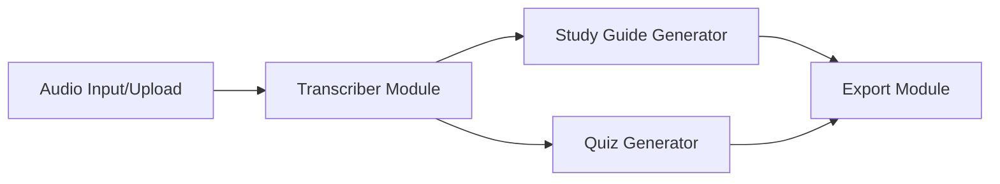

# LecAud System Design

## 1. Architecture Overview



## 2. Component Descriptions

### AudioProcessor
Validates and preprocesses audio files (size limits, format checks).
```python
class AudioProcessor:
    def validate_audio_file(self, file_path: str) -> bool:
        # Check size and extension
        pass
```

### Transcriber
Interfaces with the transcription model to convert audio into raw text.

### Study Guide Generator
Structures raw transcripts into formatted study materials (summaries, key terms).

### Quiz Generator
Generates multiple-choice questions from transcribed context.

### Export Module
Packages the generated study guides and quizzes into downloadable formats.
```python
def export_to_markdown(data: dict, filepath: str) -> str:
    # Writes structured data to .md
    pass
```

### UI / Session Manager
Manages user interactions and coordinates module execution.

## 3. Data Structures

### Session State (UI)
```json
{
  "current_audio_path": "/tmp/audio.wav",
  "transcript_text": "...",
  "generated_guide": {},
  "generated_quiz": [],
  "processing_status": "idle|processing|complete|error"
}
```

### Quiz JSON
```json
{
  "questions": [
    {
      "question": "What is the main topic?",
      "options": ["A", "B", "C", "D"],
      "correct_index": 0,
      "explanation": "Detailed reason."
    }
  ]
}
```

## 4. Error Handling Strategy

*   **Pre-flight Validation**: Strict checks on file size and formats before API calls.
*   **API Resilience**: Exponential backoff and retry logic for network timeouts or rate limits.
*   **State Recovery**: Persist intermediate results (e.g., transcript) so users don't lose progress on downstream failures.
*   **User Feedback**: Clear, actionable error messages in the UI.

## 5. API Integration (Gemini)

*   **Model**: Gemini Pro / Flash (depending on task complexity).
*   **Rate Limits**: Implemented token counting and request throttling to stay within quota (RPM/TPM).
*   **Costs**: Audio processing is expensive; inputs are compressed or chunked where possible to minimize token usage.
