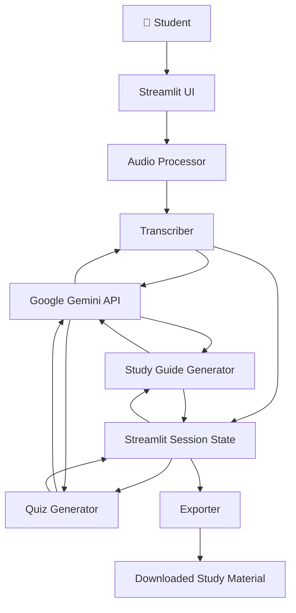
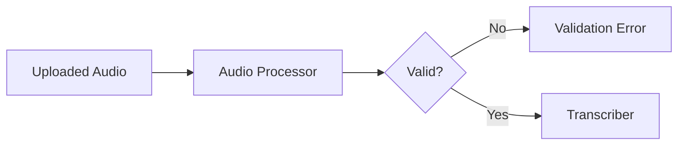
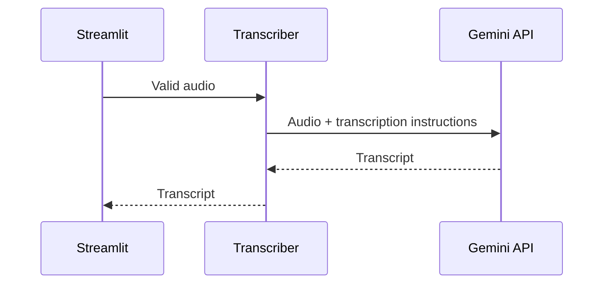
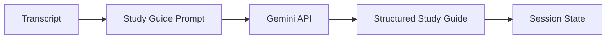
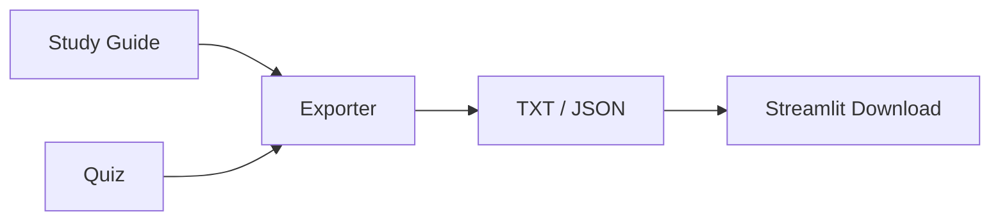
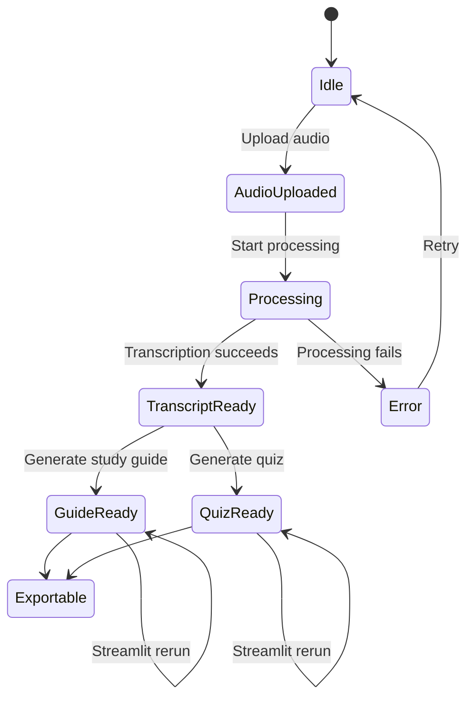
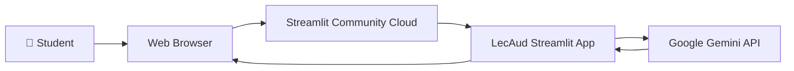
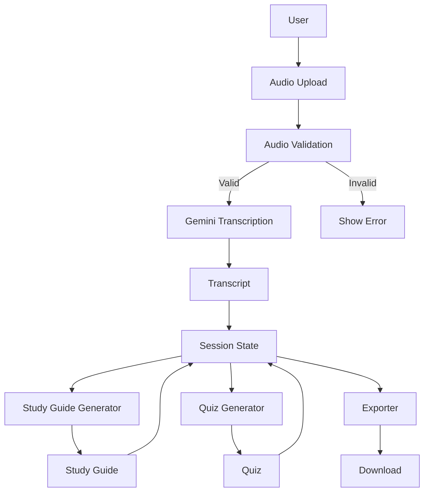

# LecAud — System Design

## 1. System Overview

LecAud is an AI-powered lecture processing application built with Python and Streamlit.

The system converts uploaded lecture audio into structured learning material through a sequential AI pipeline:

```text
Audio Input
    ↓
Audio Validation
    ↓
Gemini Transcription
    ↓
Transcript
    ├──────────────→ Study Guide Generation
    │
    └──────────────→ Quiz Generation
                         ↓
                  Structured Results
                         ↓
                       Export
```

The primary design objective is to separate the user interface, audio validation, AI processing, content generation, and export responsibilities into independent modules.

---

# 2. High-Level Architecture



---

# 3. Application Modules

## 3.1 `app.py`

`app.py` is the main application entry point.

Responsibilities:

* Configure Streamlit
* Display the user interface
* Receive uploaded audio
* Coordinate application modules
* Trigger AI processing
* Display generated results
* Manage session state
* Provide download controls
* Display errors and processing feedback

The UI layer should not contain the complete implementation of audio processing or AI generation. Those responsibilities are delegated to the modules inside `src/`.

---

# 4. Audio Processor

### Module

```text
src/audio_processor.py
```

### Responsibility

The Audio Processor acts as the first validation layer in the pipeline.

Its responsibilities include:

* Accepting uploaded audio
* Validating file type
* Validating file size
* Preparing the audio for processing
* Rejecting unsupported or invalid input before an API request

### Data Flow



This pre-flight validation prevents unnecessary Gemini API calls for invalid input.

---

# 5. Transcriber

### Module

```text
src/transcriber.py
```

### Responsibility

The Transcriber converts lecture audio into text using Gemini.

The module is responsible for:

1. Receiving validated audio
2. Preparing the Gemini request
3. Sending the audio to Gemini
4. Handling temporary API failures
5. Extracting the generated transcript
6. Returning the transcript to the application

### Processing Flow



---

# 6. Study Guide Generator

### Module

```text
src/study_guide_generator.py
```

### Responsibility

The Study Guide Generator transforms the transcript into structured revision material.

The transcript becomes dynamic context for the generation request.

Expected conceptual output includes:

```text
Summary
Key Concepts
Definitions
Important Points
Revision Material
```

### Processing Flow



---

# 7. Quiz Generator

### Module

```text
src/quiz_generator.py
```

### Responsibility

The Quiz Generator creates multiple-choice questions from the lecture transcript.

The generated quiz is expected to contain structured information such as:

```json
{
  "questions": [
    {
      "question": "Example question",
      "options": [
        "Option A",
        "Option B",
        "Option C",
        "Option D"
      ],
      "correct_index": 0,
      "explanation": "Explanation of the correct answer."
    }
  ]
}
```

The exact number of questions can depend on the application's configuration and generation logic.

---

# 8. Export Module

### Module

```text
src/exporter.py
```

### Responsibility

The Exporter converts generated results into downloadable formats.

Current supported export targets include:

* TXT
* JSON

### Export Flow



---

# 9. Session State Architecture

Streamlit reruns the application script when users interact with widgets.

Therefore, intermediate application results should be stored in:

```python
st.session_state
```

The intended LecAud state model is:

```python
{
    "current_audio": None,
    "transcript_text": "",
    "generated_guide": {},
    "generated_quiz": [],
    "processing_status": "idle"
}
```

## Intended State Flow



## Important Implementation Requirement

The application should initialize state only when the corresponding key does not already exist.

Conceptually:

```python
if "transcript_text" not in st.session_state:
    st.session_state.transcript_text = ""

if "generated_guide" not in st.session_state:
    st.session_state.generated_guide = {}

if "generated_quiz" not in st.session_state:
    st.session_state.generated_quiz = []
```

The application should **not** repeatedly overwrite these values during every Streamlit rerun.

For example, this pattern is unsafe:

```python
st.session_state.transcript_text = ""
```

when it executes on every rerun.

Instead, initialization should happen conditionally:

```python
if "transcript_text" not in st.session_state:
    st.session_state.transcript_text = ""
```

## Current Status

Session-state persistence is currently being debugged.

The final implementation should verify that:

1. A generated transcript survives widget reruns.
2. A generated study guide survives navigation/reruns.
3. A generated quiz survives navigation/reruns.
4. Generating a quiz does not erase the transcript.
5. Generating a study guide does not erase the quiz.
6. Existing AI results are not regenerated unnecessarily.

---

# 10. API Integration

LecAud uses the Google Gemini API as its primary AI engine.

The application separates AI responsibilities into distinct operations:

```text
Audio
  ↓
Gemini Transcription

Transcript
  ↓
Gemini Study Guide Generation

Transcript
  ↓
Gemini Quiz Generation
```

This architecture keeps each AI task focused rather than combining the entire workflow into a single generic prompt.

---

# 11. Prompt Architecture

Each AI operation uses task-specific instructions.

## Transcription

```text
Audio
+
Transcription Instructions
↓
Transcript
```

The goal is to convert spoken lecture content into readable text while preserving the important educational information.

## Study Guide

```text
Transcript
+
Study Guide Instructions
↓
Structured Study Material
```

The transcript is dynamically inserted as context.

## Quiz

```text
Transcript
+
Quiz Instructions
↓
Structured MCQs
```

The generated questions should be based on the supplied lecture content rather than unrelated general knowledge.

---

# 12. Error Handling

LecAud uses multiple layers of error handling.

## Layer 1 — Input Validation

Before making an AI request:

```text
Check file
    ↓
Supported format?
    ↓
Within size limit?
    ↓
Continue
```

Invalid files should be rejected immediately.

## Layer 2 — API Error Handling

Gemini requests may fail because of:

* Network problems
* API limits
* Temporary service errors
* Invalid configuration
* Unexpected responses

The application should catch these failures and display an actionable Streamlit error rather than terminating the application.

## Layer 3 — Output Validation

AI-generated structured responses should be validated before being passed to downstream UI or export functions.

Conceptually:

```text
Gemini Response
      ↓
Parse
      ↓
Validate
      ↓
Valid?
  ↙       ↘
No         Yes
 ↓          ↓
Error      Store
```

---

# 13. Retry Strategy

The AI processing layer is designed to tolerate temporary failures.

The intended strategy is:

```text
Request
  ↓
Failure?
  ↓
Retry
  ↓
Failure?
  ↓
Retry
  ↓
Failure?
  ↓
Return user-facing error
```

Retries should be limited so that a persistent failure does not result in an excessive number of API calls.

---

# 14. API Key & Security

The Gemini API key must never be hard-coded into source code.

For Streamlit deployment, secrets should be stored through Streamlit's secrets mechanism.

Example:

```toml
GEMINI_API_KEY = "your-api-key"
```

The following should never be committed:

```text
.streamlit/secrets.toml
```

The repository should instead contain a safe example configuration if required:

```text
.streamlit/secrets.toml.example
```

---

# 15. Deployment Architecture

LecAud is designed for Streamlit Community Cloud.



The cloud deployment must obtain the Gemini API key from configured secrets rather than from the repository.

---

# 16. Dependency Architecture

The primary runtime dependencies are Python packages defined in:

```text
requirements.txt
```

The deployment environment should be able to install these dependencies without requiring local machine-specific software.

The application should therefore avoid dependencies that require unavailable system-level components unless the deployment platform explicitly supports them.

---

# 17. Data Flow

The complete application data flow is:



---

# 18. Design Principles

LecAud follows several core design principles.

### Separation of Responsibilities

Each module has a specific responsibility:

```text
Audio Processor → Validation
Transcriber → Transcription
Study Guide Generator → Study Material
Quiz Generator → Assessment
Exporter → Downloads
app.py → UI & Coordination
```

### Reusable Intermediate Results

The transcript is treated as an intermediate artifact that can feed multiple downstream operations.

This avoids unnecessary repetition of the transcription step.

### Task-Specific AI

Gemini is used for defined tasks rather than as an unrestricted chatbot.

### User Feedback

Long-running AI operations should provide visible progress or status information.

### Failure Isolation

A failure in quiz generation should not require the user to lose an already generated transcript or study guide.

---

# 19. Current Known Limitations

The current implementation has a known area requiring final verification:

### Session State

The session-state persistence mechanism is currently being debugged.

The intended architecture is documented above, but the final implementation must be tested against actual Streamlit reruns before submission.

Other practical limitations include:

* AI-generated content can contain inaccuracies.
* Transcription quality depends on audio clarity.
* Gemini API limits can affect processing.
* Long recordings can increase processing time and token usage.
* Cloud execution can differ from the local development environment.

---

# 20. Final Validation Requirements

Before final capstone submission, the following workflow should be tested from a clean environment:

```text
1. Start application
       ↓
2. Upload lecture
       ↓
3. Validate audio
       ↓
4. Generate transcript
       ↓
5. Trigger a Streamlit rerun
       ↓
6. Confirm transcript remains
       ↓
7. Generate study guide
       ↓
8. Trigger another rerun
       ↓
9. Confirm transcript + study guide remain
       ↓
10. Generate quiz
       ↓
11. Trigger another rerun
       ↓
12. Confirm all generated data remains
       ↓
13. Export results
       ↓
14. Test deployed application
```

A successful end-to-end test should be completed both locally and on the deployed Streamlit application before the project is considered submission-ready.
