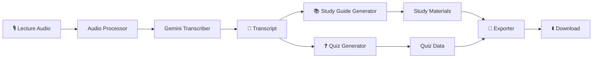
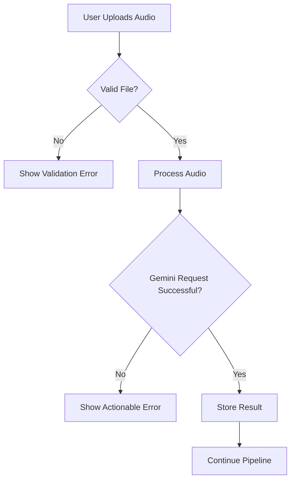

# 🎙️ LecAud

> **Turn lecture audio into study-ready material in seconds.**

LecAud is an AI-powered study assistant built for students who want to turn raw lecture recordings into useful study material without manually rewriting hours of notes.

The application uses **Google Gemini** to process lecture audio, generate a structured transcript, create a study guide, and produce an interactive quiz from the same lecture content.

---

## ✨ Features

* 🎙️ **Lecture Audio Processing** — Upload a lecture recording directly through the Streamlit interface.
* 📝 **AI Transcription** — Convert lecture audio into a readable transcript using Gemini.
* 📚 **Study Guide Generation** — Transform the transcript into structured revision material.
* 🧠 **Key Concepts & Definitions** — Extract important concepts and terminology from the lecture.
* ❓ **AI-Generated Quiz** — Generate multiple-choice questions based specifically on the lecture.
* 💾 **Export** — Download generated study material in supported TXT/JSON formats.
* 🛡️ **Input Validation** — Validate uploaded files before sending them to the AI pipeline.
* ⚡ **Streamlit Interface** — Simple, student-focused interface for the complete workflow.

---

## 🎯 Problem Statement

Students often leave lectures with incomplete notes or recordings that are difficult to revisit later. Turning those recordings into useful revision material manually is time-consuming.

LecAud addresses this by creating an automated pipeline:

**Lecture Audio → Transcript → Study Guide → Quiz → Export**

Instead of treating Gemini as a generic chatbot, LecAud uses it as a task-specific processing engine for each stage of the learning workflow.

---

## 🏗️ Architecture



For the detailed system architecture, data flow, session-state design, API strategy, and error handling, see [`SYSTEM_DESIGN.md`](SYSTEM_DESIGN.md).

---

## 🧰 Tech Stack

| Technology        | Purpose                                   |
| ----------------- | ----------------------------------------- |
| Python            | Application logic                         |
| Streamlit         | Web interface                             |
| Google Gemini API | Audio processing and AI generation        |
| Pandas            | Structured data processing where required |
| pytest            | Testing                                   |
| Mermaid           | Architecture documentation                |

---

## 📂 Project Structure

```text
LecAud/
│
├── app.py
├── requirements.txt
├── README.md
├── SYSTEM_DESIGN.md
│
├── src/
│   ├── __init__.py
│   ├── audio_processor.py
│   ├── transcriber.py
│   ├── study_guide_generator.py
│   ├── quiz_generator.py
│   └── exporter.py
│
├── tests/
│   └── ...
│
├── utils/
│   └── ...
│
└── .streamlit/
    └── secrets.toml
```

---

## 🔄 How It Works

### 1. Upload

The user uploads a lecture audio file through Streamlit.

The Audio Processor performs basic validation before the file enters the AI pipeline.

### 2. Transcription

The validated audio is passed to the Gemini-powered transcription module.

The result is a text transcript representing the lecture content.

### 3. Study Guide

The transcript is passed as context to the Study Guide Generator.

Gemini converts the raw transcript into structured study material such as:

* Summary
* Key concepts
* Important definitions
* Main points
* Revision-oriented content

### 4. Quiz

The same transcript is passed to the Quiz Generator.

Gemini produces structured multiple-choice questions with:

* Question
* Options
* Correct answer
* Explanation

### 5. Export

Generated results can be downloaded for offline revision.

---

## 🤖 AI & Prompt Engineering

LecAud uses Gemini for task-specific generation rather than exposing a generic chat interface.

Each generation stage receives a dedicated instruction and the relevant lecture context.

Conceptually:

```text
Lecture Audio
     ↓
Transcription Prompt
     ↓
Transcript
     ↓
Study Guide Prompt ──→ Study Guide
     ↓
Quiz Prompt ─────────→ Quiz
```

Dynamic transcript content is injected into downstream prompts so that generated material remains grounded in the uploaded lecture.

---

## 🔐 Configuration

LecAud requires a Gemini API key.

For local development, create:

```text
.streamlit/secrets.toml
```

and configure:

```toml
GEMINI_API_KEY = "your-api-key"
```

**Never commit `secrets.toml` or any API key to GitHub.**

A safe example configuration can be provided separately as:

```text
.streamlit/secrets.toml.example
```

---

## 🚀 Local Setup

### 1. Clone the repository

```bash
git clone https://github.com/Anushiv7/LecAud.git
cd LecAud
```

### 2. Create a virtual environment

Windows:

```bash
python -m venv .venv
.venv\Scripts\activate
```

Linux/macOS:

```bash
python -m venv .venv
source .venv/bin/activate
```

### 3. Install dependencies

```bash
pip install -r requirements.txt
```

### 4. Configure Gemini

Create `.streamlit/secrets.toml`:

```toml
GEMINI_API_KEY = "your-api-key"
```

### 5. Start LecAud

```bash
streamlit run app.py
```

The application will open through the Streamlit local development server.

---

## ☁️ Deployment

LecAud is designed to run on **Streamlit Community Cloud**.

Deployment requires:

1. A public GitHub repository
2. A valid `requirements.txt`
3. A configured `GEMINI_API_KEY` secret
4. `app.py` as the application entry point

The deployed application:

**[https://lecaud.streamlit.app](https://lecaud.streamlit.app/)**

> The live URL should be considered the authoritative demo only after the final cloud deployment test has passed.

---

## 🧠 Session State

LecAud uses Streamlit session state as the intended mechanism for preserving generated data across Streamlit reruns.

The application state is designed around values such as:

```text
uploaded audio
     ↓
transcript
     ↓
study guide
     ↓
quiz
```

The intended state model includes:

```python
st.session_state
```

for storing intermediate results so that generating a downstream artifact does not require unnecessarily repeating previous Gemini calls.

> **Current development note:** session-state persistence is still being finalized and should be verified before the final capstone submission.

---

## 🛡️ Error Handling

The application performs validation before expensive AI operations.

The intended error-handling flow is:



The application is designed to handle:

* Invalid file types
* Oversized uploads
* Missing API configuration
* Gemini/API failures
* Invalid AI responses
* Downstream generation failures

---

## 📊 Capstone Rubric Alignment

LecAud is designed around the technical requirements of the MirAI School of Technology capstone.

### Technical Implementation

* Modular Python architecture
* Streamlit application
* Input validation
* AI processing pipeline
* Session-state architecture
* Error handling
* Testing

### AI Integration

* Gemini API integration
* Audio processing
* Task-specific prompts
* Dynamic lecture context
* Structured quiz generation
* Study-material generation

### UI/UX

* Streamlit layout
* Interactive controls
* Structured study material
* Expandable content
* Downloadable outputs

### Deployment

* Streamlit Community Cloud compatibility
* `requirements.txt`
* Streamlit secrets
* Cloud-ready Python application

### Open Source

* GitHub repository
* Architecture documentation
* Setup instructions
* System design documentation

---

## ⚠️ Known Limitations

* AI-generated transcripts and study material may occasionally contain inaccuracies.
* Output quality depends on the quality and clarity of the uploaded lecture audio.
* Gemini API availability and usage limits may affect processing.
* Very long recordings may require additional processing or optimization.
* Session-state persistence is currently being finalized and must be validated before final submission.

---

## 🔮 Future Improvements

* 🎤 Direct microphone recording
* 📊 Learning analytics dashboard
* 📈 Topic-frequency visualization
* 🧩 Spaced-repetition flashcards
* 🔍 Transcript search
* 📱 Improved mobile interface
* 📑 PDF study-guide export
* 🗂️ Persistent lecture history
* 🎯 Personalized difficulty levels for quizzes

---

## 👨‍💻 Author

**Anushiv Prakash**

B.Tech Computer Science & Engineering — Software Engineering
SRM Institute of Science and Technology

Built as part of the **MirAI School of Technology Virtual Summer Internship 2026**.

---

## 📜 License

This project is intended as an educational and open-source capstone project.
