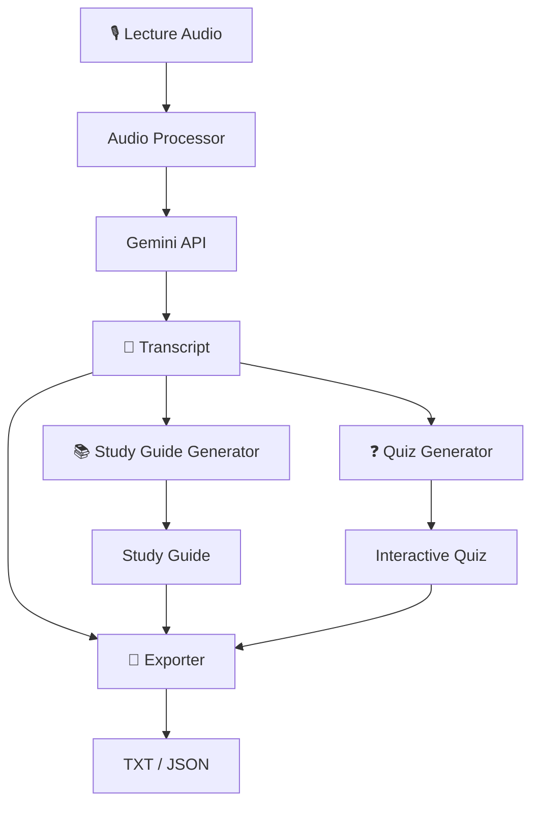

# 🎙️ VoiceScript

> **Turn lecture audio into study-ready material.**

VoiceScript is an AI-powered study assistant that transforms recorded or uploaded lecture audio into structured learning material.

The goal is simple: instead of spending hours turning a messy lecture recording into usable notes, let AI handle the first pass — from **audio → transcript → study guide → quiz**.

🚧 **Status: Work in Progress — Day 1**

This project is being developed as a capstone project for the **MirAI School of Technology Virtual Summer Internship 2026**.

---

## ✨ What I'm Building

VoiceScript is designed to take a lecture recording and turn it into:

* 🎙️ **Lecture Transcripts** — Convert spoken lectures into structured text
* 📚 **Study Guides** — Extract key concepts, topics, summaries, definitions, and applications
* ❓ **Interactive MCQs** — Generate a short quiz based on the lecture
* 💾 **Exports** — Download generated study material in TXT/JSON formats

The planned user flow is:

```text
Lecture Audio
     │
     ▼
┌───────────────┐
│ Audio Input   │
│ Record/Upload │
└───────┬───────┘
        │
        ▼
┌───────────────┐
│ Gemini API    │
│ Transcription │
└───────┬───────┘
        │
        ▼
   ┌────┴─────┐
   │          │
   ▼          ▼
Transcript  Study Guide
   │          │
   └────┬─────┘
        │
        ▼
      Quiz
        │
        ▼
     Export
```

---

## 🧠 Why VoiceScript?

Students often have to spend significant time turning lecture recordings and unstructured notes into something they can actually study from.

VoiceScript aims to reduce that friction by creating a complete study workflow from a single lecture recording.

Instead of:

```text
Lecture → Messy Notes → Manual Organization → Manual Revision
```

the goal is:

```text
Lecture → VoiceScript → Study Material → Revision
```

---

## 🚀 Planned Features

### 🎙️ Audio Input

* Record audio directly in the browser
* Upload existing lecture recordings
* Support WAV, MP3, M4A and OGG
* Audio preview before processing
* File validation and size limits

### 📝 Transcription

* Gemini-powered audio transcription
* Preserve technical terminology
* Retry handling for API failures
* Transcript persistence using Streamlit session state
* Word count and estimated reading time

### 📚 Study Guide Generation

Generate a structured study guide containing:

* Key concepts
* Main topics
* Concise explanations
* Summary
* Important formulas and definitions
* Real-world applications

### ❓ Interactive Quiz

Generate five MCQs from the lecture:

* Four options per question
* Correct answer
* Explanation for each answer
* Multiple difficulty levels
* Score calculation
* Retake support

### 💾 Export

Planned export formats include:

* `.txt` transcript
* `.txt` study guide
* `.json` quiz
* Combined study material

---

## 🏗️ Architecture



The application is being structured into separate modules for audio processing, transcription, content generation, quiz generation, exporting, validation, and session-state management.

---

## 🛠️ Tech Stack

| Technology                    | Purpose                               |
| ----------------------------- | ------------------------------------- |
| **Python**                    | Core application logic                |
| **Streamlit**                 | Web application and UI                |
| **Google Gemini API**         | Audio transcription and AI generation |
| **Pandas**                    | Data processing/export                |
| **JSON**                      | Structured quiz output                |
| **Git + GitHub**              | Version control                       |
| **Streamlit Community Cloud** | Planned deployment                    |
| **Mermaid**                   | Architecture diagrams                 |

The project is intentionally built around free-tier tooling wherever possible.

---

## 📁 Project Structure

```text
VoiceScript/
│
├── app.py
├── requirements.txt
│
├── src/
│   ├── audio_processor.py
│   ├── transcriber.py
│   ├── study_guide_generator.py
│   ├── quiz_generator.py
│   └── exporter.py
│
├── prompts/
│   ├── system_prompts.py
│   ├── study_guide_prompt.txt
│   └── quiz_prompt.txt
│
├── utils/
│   ├── constants.py
│   ├── validators.py
│   ├── logger.py
│   └── session_manager.py
│
├── tests/
│
├── docs/
│
├── assets/
│
├── .streamlit/
│   └── secrets.toml
│
├── README.md
├── PRD.md
├── FLOW_OF_EXECUTION.md
├── SCAFFOLDING.md
├── TECH_STACK.md
├── PROBLEM_SELECTION.md
└── REVIEW.md
```

The project documentation also maintains a dedicated execution flow, scaffolding specification, technical stack reference, and code-review/change log.

---

## ⚙️ Local Setup

### 1. Clone the repository

```bash
git clone https://github.com/Anushiv7/VoiceScript.git
cd VoiceScript
```

### 2. Create a virtual environment

```bash
python -m venv .venv
```

Activate it on Windows:

```bash
.venv\Scripts\activate
```

### 3. Install dependencies

```bash
pip install -r requirements.txt
```

### 4. Configure your Gemini API key

Create:

```text
.streamlit/secrets.toml
```

and add:

```toml
GEMINI_API_KEY = "your-api-key-here"
```

**Never commit `secrets.toml` or any API keys to GitHub.**

### 5. Run the application

```bash
streamlit run app.py
```

The application should then be available at:

```text
http://localhost:8501
```

---

## 📋 Development Roadmap

### Phase 1 — Foundation

* [x] Project concept selected
* [x] PRD created
* [x] Technical stack defined
* [x] Project structure planned
* [x] Development repository created
* [ ] Core implementation

### Phase 2 — Core AI Pipeline

* [ ] Audio input
* [ ] Audio validation
* [ ] Gemini transcription
* [ ] Transcript display
* [ ] Study guide generation
* [ ] Quiz generation

### Phase 3 — UX & Export

* [ ] Five-tab interface
* [ ] Interactive quiz
* [ ] Session-state management
* [ ] TXT/JSON exports
* [ ] Error handling
* [ ] Loading states

### Phase 4 — Testing & Deployment

* [ ] Local testing
* [ ] Edge-case testing
* [ ] Documentation
* [ ] Architecture diagrams
* [ ] Streamlit Community Cloud deployment
* [ ] Final capstone submission

The overall project is planned across August 11–25, 2026, with deployment targeted toward Streamlit Community Cloud.

---

## 📖 Documentation

| Document                                       | Purpose                                         |
| ---------------------------------------------- | ----------------------------------------------- |
| [`PRD.md`](PRD.md)                             | Product requirements and feature specifications |
| [`PROBLEM_SELECTION.md`](PROBLEM_SELECTION.md) | Problem selection and rubric strategy           |
| [`SCAFFOLDING.md`](SCAFFOLDING.md)             | Project structure and module design             |
| [`FLOW_OF_EXECUTION.md`](FLOW_OF_EXECUTION.md) | Application execution flow                      |
| [`TECH_STACK.md`](TECH_STACK.md)               | Tools, dependencies and setup                   |
| [`REVIEW.md`](REVIEW.md)                       | Development decisions and change log            |

---

## 🎯 Project Goals

The project is being developed with six main evaluation areas in mind:

* **Technical Implementation**
* **AI Integration**
* **UI/UX**
* **Deployment**
* **GitHub & Branding**
* **Documentation**

The intended final system combines Gemini-powered transcription with structured study-guide and quiz generation, wrapped in a Streamlit interface.

---

## 🗓️ Development Log

This repository is being built incrementally, with development decisions and significant changes documented in [`REVIEW.md`](REVIEW.md).

### Day 1

**Project foundation & scaffolding**

* Project repository initialized
* Streamlit application foundation created
* Requirements defined
* Environment/secrets configuration established
* Session-state structure planned
* Project architecture and documentation organized

More updates coming as development continues.

---

## 👨‍💻 Developer

**Anushiv Prakash**

Capstone Project — MirAI School of Technology
Virtual Summer Internship 2026

---

## 📌 Status

> 🚧 **VoiceScript is currently under active development.**

The architecture and product requirements are defined; implementation is now underway.

---

Made with love by Anushiv.❤️
